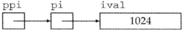

C++Primer_5th_Note

#### Chapter 2: variable, const...
*	0 为 false， 非0 为 true；
*	变量初始化不是赋值: 初始化的含义是创建变量时赋予其一个初始值， 而赋值的含义是把对象的当前值擦除，而以一个新值来代替；
*	列表初始化时，如果损失精度，编译器会报错： int a{0};  long double ld = 3.1415926; int a{ld};
*	变量初始化值：
    - 三条性质：
              - 定义在任何函数体外的变量会被初始化为0。
              - 定义在函数体内部的变量不会被初始化。
              - 类的对象未被初始化，则初值由类决定。

*	& 引用类型是一个已经存在的对象的别名，声明绑定时必须被初始化；
```
        int i, &ri = i;
        i = 5; ri = 10; // ri = 10 相当于 i = 10
        cout << i << " " << ri << endl;  // (10 10)
```
*	int &r2 = *p; // reference r2 引用了指针 p 所指向的对象；
*	使用指针之前，必须将其先初始化；
*	int **ppi = &pi; // ppi 是指向一个指针的指针；
  int ival = 1024;
  int *pi = &ival;
  int **ppi = &pi;
  cout << "pi: " << pi << endl; // pi address
  cout << "*pi: " << *pi << endl; // 1024
  cout << "*ppi: " << *ppi << endl; // pi address
  cout << "**ppi: " << **ppi << endl; // 1024   


*	int *p; int *&r = p; 从右向左读，r 是一个引用，其引用的是 p 指针；
*	const 指针：始终指向其所指向的对象，但可以改变对象的值；
*	顶层const的拷贝不受限制，但是底层const的拷贝的对象必须具有相同的底层const资格。一般来说：非常量可以赋值给常量，反之则不行;
*	指向常量的指针与常量指针完全不同：
        指向常量的指针(low-level const):  可以指向其他对象,
        常量指针(high-level const): 不可以再指向其他对象,但可以改变所指向对象的值；
*	alias: 1. typedef double wages;  2. using SI = Sales_item;
*	decltype(f()) sum = x; (declare type);
*	decltype(())双层括号表示引用（注意引用必须初始化）
*	赋值的表达式语句本身是一种引用；
*	auto会识别为其所指对象的类型，decltype则会识别为引用的类型；
#### Chapter 3: string，vector， array
*	访问字符串中的字符之前一定要有判空操作 if (!s.empty()){...}；
*	vector的初始化：
1：引用不可以成为vector的元素，因为其不是对象。
2：可以用花括号初始化每一个值。
3：可以用圆括号指定元素个数或相同的元素值。
4：只能使用直接初始化，不可以使用拷贝初始化（vector之间的拷贝是可行的，但要保证类型相同）
*	空 vector 不能使用下标  vector<int> ivec;
*	array: 大小是固定的，声明维度[ ] 必须是一个大于0的整数或一个常量表达式, 其类型不允许使用auto；
*	array 声明：
    - int* a[10]; //a数组含有10个指针整形
    - int &a[10]; //错误，不存在引用的数组
    - int (*a)[10]; //a是一个指针，指向一个含有10个整数的数组
    - int (&a)[10]; //a是一个引用，引用一个含有10个整数的数组
    - int *(&a)[10]; // a是数组的引用，数组含有十个指针
    - 理解方法：从数组的名字开始，由内向外顺序读取，先左后右，左边为类型。
*	数组的缺点：数组的大小是确定不变的，不可以向数组中添加元素，丧失了vectoer的灵活性;
*	array 的下标可以是负数 int k = p[-2];
*	for 处理多维数组时，除了最内层的循环外，其他所有循环的控制变量都应该是引用类型；
#### Chapter 4:
*	优先级：算数(+-*/%)>关系(><==)>逻辑(&&||!);
*	ptr—>mem 与 (*ptr).mem 等价;
#### Chapter 6:
*	high-level(const): 常量指针 int* const ptr 、常量引用 string const &str (指针或引用本身是 const，但可以修改对象的值, 定义同时必须初始化 );
           low-level(const):  指针常量 const int* ptr 、引用常量 const string *str (指向或引用的是 const, 只读, 但指针可以指向不同的对象)
        如果函数不需要修改对象，则应该在形参中使用 low-level const


口诀：左low读，右high写 (指针类型)	(就近原则, 离谁近谁只读)
```
int main()
{
    int a = 100;
    const int* p;    // high-level const read-only
    p = &a;
    //*p = 10;
    printf("a = %d\n", *p);
    int b = 200;
    p = &b;
    printf("b = %d\n", *p);
    int* const p1 = &a;    // low-level const write
    //p1 = &a;
    *p1 = 101;
    printf("a = %d\n", a);
    return 0;
}
```
*	数组不允许拷贝；
*	将数组名作为实参传递给函数时，会被自动转换成指针，实际上是传递该数组的首元素地址；
*	使用argv中的实参时，一定要记得可选参数从argv[1]开始，argv[0]保存的是程序的名字;
*	int main(int argc, char *argv[ ]){…} : argv 是指向字符串数组的指针；
*	函数返回值：循环后面也应该有一条 return 语句；
*	不要返回局部对象的引用或指针；
*	在函数内部定义的局部函数会隐藏掉该函数外部定义的同名函数；
*	一旦函数的某个形参被赋予了默认值，他后面所有的参数都必须有默认值;
*	函数默认实参的初始值要在函数声明之前定义；
*	有默认值的形参要放后面；
*	内联函数是指编译时将调用函数的地方用实际函数体语句替代的一类函数 inline (remove overhead);
*	assert依赖于一个NDEBUG的预处理变量的状态，如果定义了NDEBUG，assert什么也不做，默认状态下NDEBUG是未定义的;
*	assert 应该用于检查不能发生的条件；
*	函数调用不应该涉及参数的强制类型转换；
*	函数指针指向的是函数而非函数对象；
*	bool (*pf) (const string &, const string &)//pf指向一个函数返回值类型为bool，此时还未初始化。pf两端的括号必不可少，若无括号，pf为一个返回值为bool指针的函数。
*	当我们把函数名当作一个值使用时，函数自动的转换为指针，直接赋予或者取址皆可。可以直接使用只想该函数的指针调用该函数;   pf = lengthcompare;
*	函数形参中的函数类型会被自动转换为函数指针；
*	using F = int(int*, int); // F is a function type, not a pointer
  using PF = int(*)(int*, int); // PF is a pointer type
#### Chapter07: class
*	this 是一个在成员函数体内隐藏的常量指针；
*	C++中的 struct 和 class 基本是通用的，唯有几个细节不同：
	* 使用 class 时，类中的成员默认都是 private 属性的；而使用 struct 时，结构体中的成员默认都是 public 属性的。(最本质的区别)
	* class 继承默认是 private 继承，而 struct 继承默认是 public 继承（《C++继承与派生》一章会讲解继承）。
	* class 可以使用模板，而 struct 不能。
	* 总结
    	- struct作为数据结构的实现体，它默认的数据访问控制是public的，而class作为对象的实现体，它默认的成员变量访问控制是private的
    	- 当你觉得你要做的更像是一种数据结构的话，那么用struct，如果你要做的更像是一种对象的话，那么用class。  
    	- 然而对于访问控制，应该在程序里明确的指出，而不是依靠默认，这是一个良好的习惯，也让你的代码更具可读性。  
*	紧跟在参数列表之后的const表示this是一个常量指针——关于const成员函数，表明常量成员函数不能改变调用它对象的内存，也就是表示该函数只可访问，不可修改。std::string isbn() const { return bookNo; }
*	return *this; // 返回调用该函数的对象；
*	IO类型的引用作为其参数，IO类属于不能被拷贝的类型，只能用引用来传递它们
*	构造函数—特殊的成员函数，用来控制对象的初始化过程。无返回类型，可重载，不能被声明为const.
*	定义构造函数后，还必须定义一个默认构造函数；
*	class 默认访问权限是 private, 而 struct 的默认访问权限是public;
*	friend: 声明使用到class 的 private 属性的 接口函数;
*	成员函数也可以被重载；
*	class 内部的函数自动 inline；
*	friend 没有传递性；
*	在类内声明的友元必须在类内或者类外进行定义之后才可以使用;
*	在类的外部定义的函数，必须声明类作用域，其函数名和返回类型都需要进行声明;
*	编译器先处理完类中的所有成员声明，然后才处理成员函数的定义；
*	typedef 要放在 class 的开始处，不能重复定义；
*	名字查找的顺序：由内而外、自上而下;
*	在类中，类型名要特殊处理，最好是定义在类的一开始，并且不能与外层作用域中同名;
*	构造函数的初始值列表顺序应该与其成员声明的顺序保持一致；
*	explicit 可以阻止构造函数的隐式类型转换,但不能阻止强制类型转换；
*	static 对象被所有该 class 成员对象所共享；
#### Chapter08: I/O
*	IO对象无拷贝或赋值
*	使用IO流之前要先检查其状态：一般放在条件中来使用，
  如 while(cin >> word) {...};
